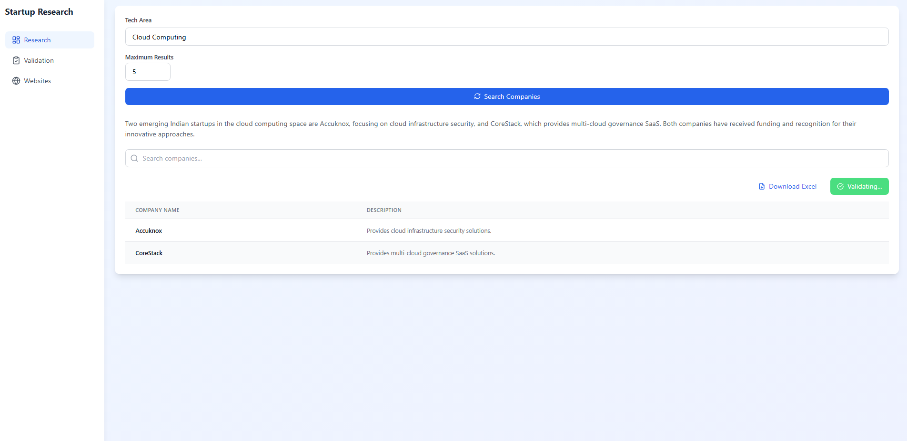
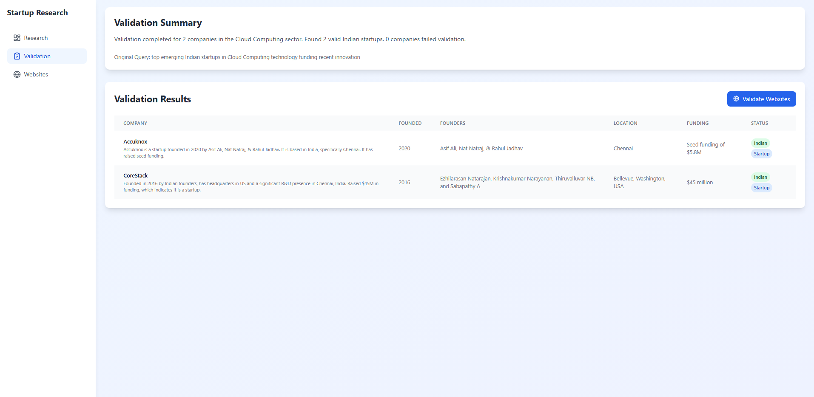
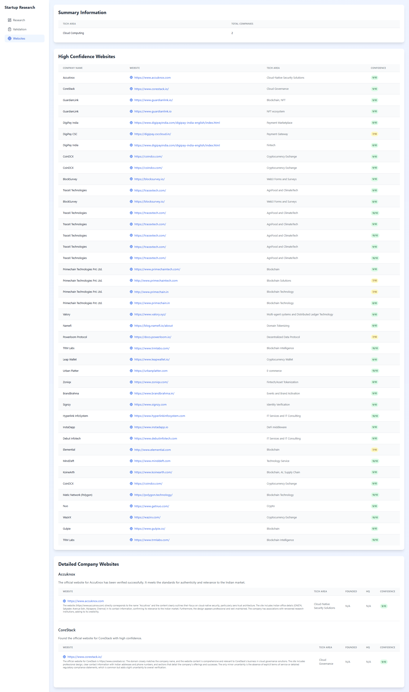

# Indian Startup Discovery Platform (v2)

## Overview

The Indian Startup Discovery Platform is an advanced multi-agent AI system designed to research, validate, and catalog emerging Indian technology startups across various technological domains. Utilizing state-of-the-art AI techniques, the platform automates the process of discovering and documenting promising startups.





## Key Features

- 🔍 Comprehensive Startup Research
- 🏢 Multi-Stage Validation Process
- 🌐 Official Website Discovery
- 📊 Structured Data Collection
- 🚀 RESTful API Integration

## Technology Stack

### Backend
- Python 3.9+
- Flask
- SQLAlchemy
- Pydantic AI
- Tavily AI Search

### Frontend
- React
- Next.js
- Tailwind CSS
- Shadcn/UI

### Database
- MySQL
- SQLAlchemy ORM

## Project Architecture

The platform consists of three primary agents:

1. **Research Agent (agent1.py)**
   - Searches for emerging Indian startups
   - Focuses on specific technology areas
   - Extracts initial company information

2. **Validation Agent (agent2.py)**
   - Verifies startup authenticity
   - Checks Indian origin
   - Validates startup status

3. **Website Discovery Agent (agent3.py)**
   - Finds official company websites
   - Verifies website authenticity
   - Collects additional company details

## Prerequisites

- Python 3.9+
- pip
- MySQL
- Node.js 16+
- npm

## Backend Setup

1. Clone the repository
   ```bash
   git clone https://github.com/yourusername/indian-startup-discovery.git
   cd indian-startup-discovery
   ```

2. Create a virtual environment
   ```bash
   python -m venv venv
   source venv/bin/activate  # On Windows, use `venv\Scripts\activate`
   ```

3. Install Python dependencies
   ```bash
   pip install -r requirements.txt
   ```

4. Configure Environment Variables
   Create a `.env` file with the following:
   ```
   OPENAI_API_KEY=your_openai_api_key
   TAVILY_API_KEY=your_tavily_api_key
   DB_USER=your_mysql_username
   DB_PASSWORD=your_mysql_password
   DB_HOST=localhost
   DB_NAME=startups_db
   DB_PORT=3306
   ```

5. Setup MySQL Database
   ```bash
   mysql -u root -p
   CREATE DATABASE startups_db;
   exit;
   ```

## Running the Backend

1. Start the Flask API
   ```bash
   python api.py
   ```

2. Run research workflow
   ```bash
   python main.py
   ```

## Frontend Setup

1. Navigate to frontend directory
   ```bash
   cd frontend
   ```

2. Install dependencies
   ```bash
   npm install
   ```

3. Start development server
   ```bash
   npm run dev
   ```

## API Endpoints

- `POST /api/research`: Research startups in a tech area
- `POST /api/validate`: Validate startup information
- `POST /api/websites`: Find startup websites
- `GET /health`: Check system health

## Example API Request

```bash
curl -X POST http://localhost:5000/api/research \
     -H "Content-Type: application/json" \
     -d '{"tech_area": "Blockchain"}'
```

## Data Flow

1. Research Agent discovers startups
2. Validation Agent verifies authenticity
3. Website Agent finds official websites
4. Results stored in MySQL database
5. API serves validated startup information


## License

MIT License

## Disclaimer

This platform is for informational purposes. Always verify startup information independently.
